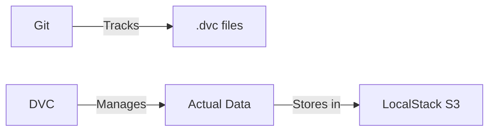

Here's a more polished and organized version of your README.md:

```markdown
# DVC Test Project
Testing DVC integration with VS Code and LocalStack

## Development Environment Setup

### VS Code Configuration
1. Set default line endings (LF):
   - Open VS Code settings (`Ctrl + ,`)
   - Search for "Eol"  
   - Set: `Eol = \n`

2. Add `.editorconfig` (recommended):
   ```ini
   [*]
   end_of_line = lf
   ```

### System Tools Installation (Admin)
```powershell
# Install Chocolatey
Set-ExecutionPolicy Bypass -Scope Process -Force
[System.Net.ServicePointManager]::SecurityProtocol = [System.Net.ServicePointManager]::SecurityProtocol -bor 3072
iex ((New-Object System.Net.WebClient).DownloadString('https://community.chocolatey.org/install.ps1'))

# Install utilities
choco install less grep -y
```

## Python & DVC Setup

### Installation
```powershell
# Install DVC with S3 support and AWS CLI
pip install --upgrade "dvc[s3]" awscli aiobotocore

# Verify installation
dvc --version
```

### Path Configuration (if needed)
1. Find DVC location:
   ```powershell
   python -m pip show dvc
   ```
2. Add to PATH:
   ```
   C:\Users\<YOUR_NAME>\AppData\Local\Packages\PythonSoftwareFoundation.Python.3.11_qbz5n2kfra8p0\LocalCache\local-packages\Python311\Scripts
   ```
3. Restart VS Code/PowerShell

## DVC Configuration

### Initialize Project
```powershell
dvc init
dvc add .\data\test.txt  # Creates cache and tracking files
```

### LocalStack S3 Setup
```powershell
dvc remote add -d mlops s3://mlops
dvc remote modify mlops endpointurl http://localhost:4566
dvc remote modify mlops use_ssl false
dvc remote modify mlops access_key_id test
dvc remote modify mlops secret_access_key test
dvc remote modify mlops region us-east-1
dvc remote modify mlops s3_path_style true
```

## Workflow Commands

### Push/Pull Data
```powershell
dvc push
dvc pull
```

### Verify Remote Storage
```powershell
dvc list . --remote=mlops
awslocal s3 ls s3://mlops/ --recursive --human-readable
```

## Git Integration

### .gitignore Setup
```gitignore
# DVC files
.dvc/cache
.dvc/tmp
.dvc/plots
dvc.lock

# Data directory rules
data/*
!data/          # Keep directory
!data/*.dvc     # Track metadata files

# Python artifacts
.venv
__pycache__/
*.pyc
```

```powershell
git add .gitignore
git commit -m "Configure DVC tracking"
```

## Maintenance

### Complete Reset
```powershell
Remove-Item -Force .dvc/config, .dvc/config.local
dvc init --force
```

## Key Concepts
- **Git** tracks `.dvc` files (metadata)
- **DVC** manages actual data files
- **LocalStack** provides local S3 emulation



> Note: All AWS credentials use dummy values (`test/test`) for LocalStack
```
